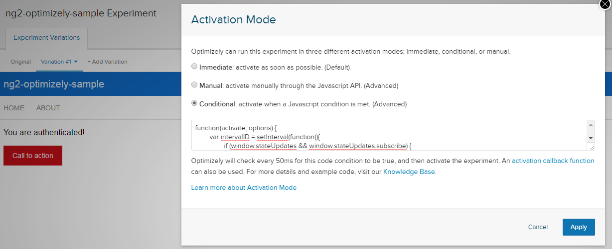

# Introduction

Sample Angular 2 application based on [angular2-seed](https://github.com/mgechev/angular2-seed).
Made specifically for testing Optimizely experiments.

This demonstrates how to expose (part of) the application state to the global window variable, for consumption by Optimizely.

# Table of Content

- [Introduction](#introduction)
- [Table of Content](#table-of-content)
- [How to start](#how-to-start)
- [Optimizely Experiment Example](#optimizely-experiment-example)
- [Configuration](#configuration)
- [Environment Configuration](#environment-configuration)
- [Tools documentation](#tools-documentation)
- [License](#license)

# How to start

**Note** that this project requires node v4.x.x or higher and npm 2.14.7.

**Note** that you have to add your Optimizely script to `index.html`.

In order to start the sample use:

```bash
git clone --depth 1 https://github.com/vankeer/ng2-optimizely-sample.git
cd ng2-optimizely-sample
# install the project's dependencies
npm install
# watches your files and uses livereload by default
npm start
# api document for the app
# npm run build.docs

# dev build
npm run build.dev
# prod build
npm run build.prod
```

_Does not rely on any global dependencies._

# Optimizely Experiment Example

Create an experiment with activation mode "conditional" and use the exposed state on the window variable to write your conditions.

For example:

```js
function (activate, options) {
	setInterval(function () {
		if (window.state && window.state.isAuthenticated) {
			activate();
		}
	}, 50);
}
```



# Configuration

Default application server configuration

```js
var PORT             = 5555;
var LIVE_RELOAD_PORT = 4002;
var DOCS_PORT        = 4003;
var APP_BASE         = '/';
```

Configure at runtime

```bash
npm start -- --port 8080 --reload-port 4000 --base /my-app/
```

## Environment configuration

If you have different environments and you need to configure them to use different end points, settings, etc. you can use the `./tools/env/config.json` file. The keys in the file are the different environments.

The can be specified by using:

```bash
npm start -- --config-env ENV_NAME
```

Currently the `ENV_NAME`s are `dev`, `prod`, `staging`, but you can simply add different key-value pairs to the `config.json` file in order to alter extra such environments.

# Tools documentation

A documentation of the provided tools can be found in [tools/README.md](tools/README.md).

# License

MIT
